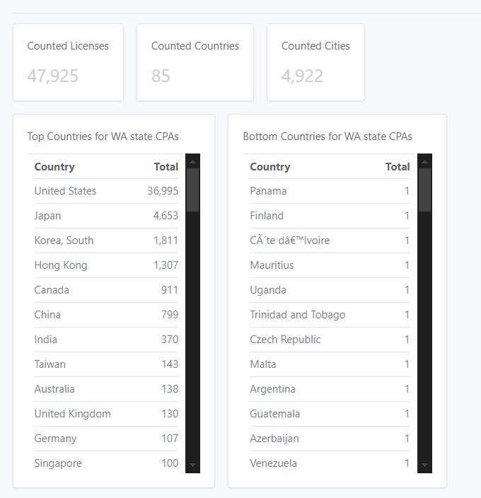
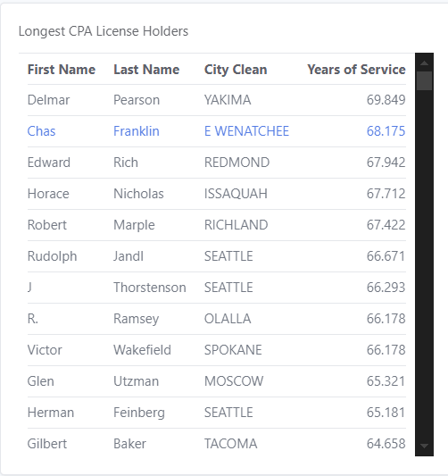
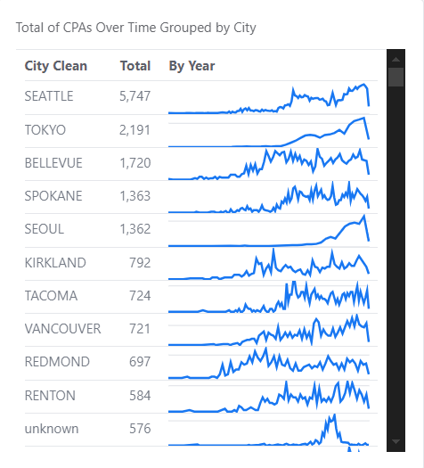
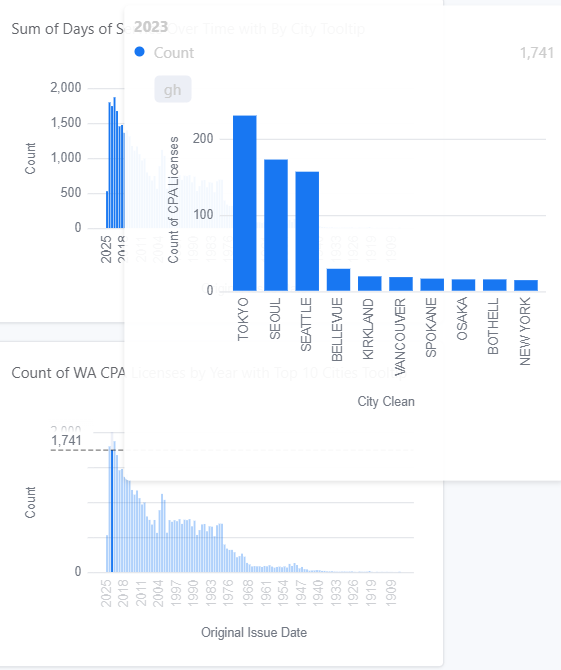
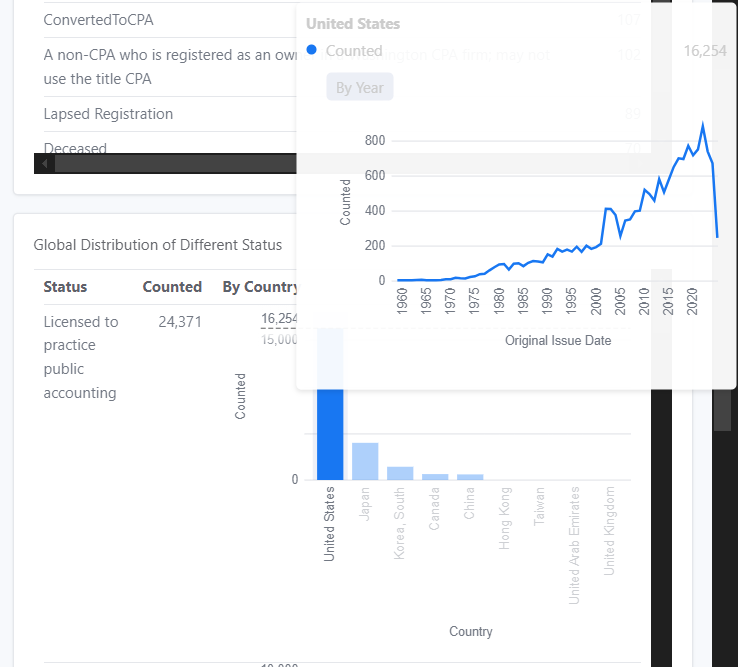

# 📜 Washington State Certified Public Accountants (CPA) Data 📊

The data in this repository comes from the [Washington State Open Data Portal](https://data.wa.gov/Consumer-Protection/Washington-State-Certified-Public-Accountants/6du3-3h9e/about_data). 📂 It provides **detailed records** on Certified Public Accountants (CPAs) licensed in **Washington State**. 🏛️📋

---

## 🔍 About the Data

This dataset contains information on **licensed CPAs** in Washington State, including:
- 📛 **Full Name** of the CPA
- 📍 **City & State** where they are based
- 🔢 **License Number** for identification
- 📅 **Issue & Expiration Dates** of the license
- 📜 **License Status** (Active, Expired, etc.)

👉 **[Click here to view the dataset](https://data.wa.gov/Consumer-Protection/Washington-State-Certified-Public-Accountants/6du3-3h9e)** 🔗

---

## 📌 Key Insights

🔹 **Tracking CPA Certifications**: This dataset is useful for individuals, firms, and regulators to verify CPA credentials. 🕵️‍♂️

🔹 **Expiration & Renewal Dates**: Helps CPAs keep track of when their licenses need to be renewed. 📆✅

🔹 **Geographic Distribution**: Shows where CPAs are concentrated within Washington State. 🌎📍

---

## ⚠️ Important Notes

🔸 **License Status**: Not all CPAs listed are actively practicing. Be sure to check the **status field** before assuming a CPA is licensed to operate. 🚦

🔸 **Data Updates**: This dataset is periodically updated, but it may not reflect real-time license changes. ⏳🔄

🔸 **Legal Disclaimer**: This data is for informational purposes only. For official verification, visit the [Washington State Board of Accountancy](https://acb.wa.gov/). ⚖️

---

## 📊 Additional Resources

📜 **[Washington State Board of Accountancy](https://acb.wa.gov/)** – Official licensing authority for CPAs in Washington State.

📘 **[Washington State Public Data Portal](https://data.wa.gov/)** – Access more datasets on businesses, public safety, and government operations.

📑 **[License Verification Tool](https://acb.wa.gov/individual-license-search)** – Look up specific CPAs and confirm their license status.

---

## 📈 Charts & Visuals Examples

## 📊 Example Visualizations  

### 🌍 CPA Origins Dashboard  

This dashboard provides a structured summary of CPA license distributions across countries and cities. It leverages aggregated counts to present a clear overview of the dataset.  

#### 🔹 **Key Metrics & Visuals:**  
- **📌 Total CPA Licenses** → A KPI metric displaying `Counted Licenses`, the total number of CPA records in the dataset.  
- **🌍 Unique Countries Count** → A KPI metric for `Counted Countries`, showing how many distinct countries are represented.  
- **🏙️ Unique Cities Count** → A KPI metric for `Counted Cities`, revealing how many cities contribute CPAs.  

#### 📊 **Country-Level Insights:**  
- **🏆 Top Countries for WA State CPAs** → A **table** grouping data by `Country`, showing the **total number of licenses per country**.  
- **📉 Bottom Countries for WA State CPAs** → A **table** highlighting the least-represented countries, ordered by `Total`.  

#### 📈 **Analytical Potential:**  
This dashboard allows users to quickly identify major sources of CPAs in Washington State. The `Top Countries for WA State CPAs` section highlights dominant contributors, while the `Bottom Countries` section can reveal underrepresented regions. Additionally, `Counted Cities` helps measure the geographic diversity within individual countries. These insights can be valuable for workforce analysis, recruitment strategies, and understanding international CPA mobility. 🚀  

## 📊 Example Visualizations  

### 🏆 Longest CPA License Holders  

This visualization highlights the most experienced CPAs in Washington State—those who have held their licenses for **nearly 70 years!** 🌟 These professionals have dedicated decades to the field, showcasing incredible longevity and expertise in accounting.  

#### 🔹 **Key Visuals:**  
- **📋 Leaderboard of Longest-Serving CPAs** → A table sorted by `Years of Service`, displaying:  
  - `First Name` & `Last Name` (identifying the CPA)  
  - `City Clean` (where they are based)  
  - `Years of Service` (showcasing their incredible tenure)  
- **📊 Bar Chart: CPA Longevity** → A visual ranking of CPAs by `Years of Service`, highlighting those with the most years in the profession.  

#### 📈 **Analytical Potential:**  
This visualization not only recognizes the **dedication and impact** of long-serving CPAs but also helps analyze career longevity trends. Are there geographic patterns in where these long-time professionals are based? How has CPA retention evolved over the decades? Understanding these trends can provide valuable insights into workforce sustainability and career trajectories.  

These CPAs have seen it all—from paper ledgers to AI-driven accounting. That’s legendary! 🏅  

## 📊 Example Visualizations  

### 🏆 Longest CPA License Holders  

This visualization highlights the most experienced CPAs in Washington State—those who have held their licenses for **nearly 70 years!** 🌟 These professionals have dedicated decades to the field, showcasing incredible longevity and expertise in accounting.  

#### 🔹 **Key Visuals:**  
- **📋 Leaderboard of Longest-Serving CPAs** → A table sorted by `Years of Service`, displaying:  
  - `First Name` & `Last Name` (identifying the CPA)  
  - `City Clean` (where they are based)  
  - `Years of Service` (showcasing their incredible tenure)  
- **📊 Bar Chart: CPA Longevity** → A visual ranking of CPAs by `Years of Service`, highlighting those with the most years in the profession.  

#### 📈 **Analytical Potential:**  
This visualization not only recognizes the **dedication and impact** of long-serving CPAs but also helps analyze career longevity trends. Are there geographic patterns in where these long-time professionals are based? How has CPA retention evolved over the decades? Understanding these trends can provide valuable insights into workforce sustainability and career trajectories.  

These CPAs have seen it all—from paper ledgers to AI-driven accounting. That’s legendary! 🏅  

## 📊 Example Visualizations  

### ⏳ CPA Growth Over Time by City  

This visualization tracks the **growth of CPA licenses over time**, grouped by city. It provides insights into how the profession has expanded in different locations, showing which cities have seen the most CPA growth over the years.  

#### 🔹 **Key Visuals:**  
- **📈 Line Chart: CPA Growth Over Time** → A **trend line** for each city, displaying CPA license counts by year (`By Year`), showing how the profession has expanded in different locations.  
- **📊 Sparkline Summary** → A **compact mini-chart** (`size=spark y.independent`) to quickly visualize CPA growth trends.  

#### 📈 **Analytical Potential:**  
This visualization helps identify:  
- **Which cities have historically produced the most CPAs.**  
- **Trends in CPA growth**—are certain cities emerging as CPA hubs?  
- **How CPA licensing has evolved over time**—did specific events or policies influence growth?  

By analyzing this data, we can uncover regional trends and shifts in CPA demand. Some cities might have seen **steady CPA growth for decades**, while others may be **newly emerging as accounting hotspots**! 🌟  

## 📊 Example Visualizations  

### 📅 WA CPA Licenses Over Time with Top 10 Cities  

This visualization tracks the number of CPA licenses issued each year in Washington State, providing insights into licensing trends over time. Additionally, it includes a **tooltip** showing the top 10 cities for CPA issuances in any given year, adding an extra layer of detail to the analysis.  

#### 🔹 **Key Visuals:**  
- **📊 Bar Chart: CPA Licenses by Year** → A **bar chart** (`y.independent`) displaying CPA license counts over time (`Count`).  
- **🛠️ Interactive Tooltip: Top 10 Cities** → Hovering over a bar reveals a **tooltip** with the **top 10 cities** (`By City Tooltip`), showing which locations had the highest number of CPA issuances in that year.  

#### 📈 **Analytical Potential:**  
This visualization helps analyze:  
- **Trends in CPA licensing over the years**—are there periods of significant growth or decline?  
- **Year-over-year changes** in CPA issuances, potentially linked to economic cycles, policy shifts, or industry demand.  
- **City-level insights**—which cities consistently produce the most CPAs, and have new cities emerged as key CPA hubs over time?  

The interactive tooltip makes it easy to drill down into specific years and spot patterns in city-level CPA production. Whether it's a **surge in licensing due to regulatory changes** or **declining numbers in certain regions**, this chart captures it all! 🚀  

## 📊 Example Visualizations  

### 🌎 Global Distribution of CPA License Status  

This visualization breaks down CPA license counts by **status** (e.g., Active, Inactive, Retired) on a global scale. It also provides insights into the **top 5 countries** with the most CPAs and how CPA issuance has changed over time in these regions.  

#### 🔹 **Key Visuals:**  
- **📊 Bar Chart: CPA Licenses by Status** → Displays the total number of CPAs grouped by `Status`. This serves as the **main breakdown** of CPA license types worldwide.  
- **🌍 Nested Bar Chart: CPA Distribution by Country** → Within each status category, a **nested bar chart** ranks the **top 5 countries** contributing to CPA licensing (`By Country`).  
- **📈 Tooltip-Enabled Line Chart: CPA Licensing Trends Over Time** →  
  - When hovering over a country, a **line chart tooltip** appears, showing **yearly CPA issuance trends** (`By Year`) for that country.  
  - This provides historical insights into how CPA licensing has evolved in major regions.  

#### 📈 **Analytical Potential:**  
This visualization helps answer:  
- **How CPA statuses vary globally**—which regions have the most active vs. inactive CPAs?  
- **Which countries are major CPA contributors**—and how they compare across different license statuses.  
- **How CPA growth trends differ by country**—with the tooltip revealing long-term shifts in CPA licensing.  

By combining **status, country distribution, and historical licensing trends**, this visualization delivers a rich understanding of global CPA dynamics. 🌍📊 Perfect for analyzing industry trends and tracking CPA profession shifts across different regions! 🚀  

---

This dataset is a valuable tool for **researchers, employers, CPAs, and the general public** looking to understand the landscape of **certified accountants in Washington State**. 🏦📊💡
